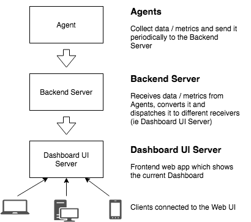
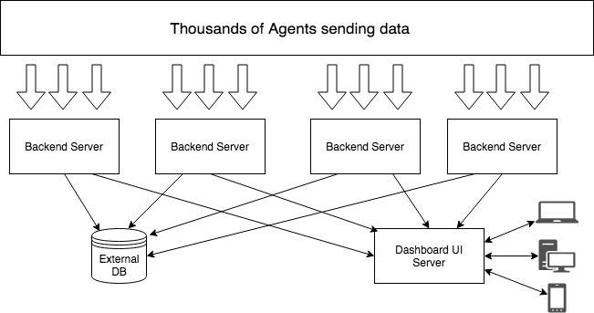
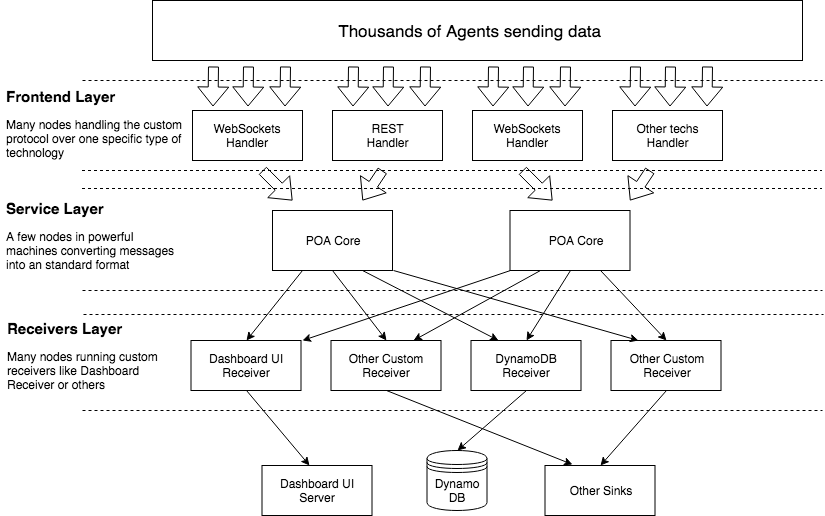

# Server Architecture

This is the diagram for the new Elixir-based architecture. We propose a new server layer between the Agents and the Sinks (with the Dashboard UI being a type of sink).

The Backend Server is the actor in this new Server layer. It is in charge of speaking with the Agents, receiving Data / Metrics, converting the data from the protocol messages to Elixir structures and dispatching the result to different Receivers based on a mapping in the config file.

Key points:
- __Custom Protocol__: The custom Protocol is the language the Agent’s Transfer and Custom Protocol Handler must speak. That defines the messages and data which can be exchanged.
  The messages defined in the protocol can be pure JSON for now but we must think in other lighter options like messagepack
  The messages will have (among others) a mandatory field for the “type of data” sent. The possible values for this field will be defined and are fixed, for now only an “ethereum_metrics” type exists. That will allow us to map the type of metric to the receiver (i.e. sending ethereum_metrics to the dashboard and system_metrics to a database)
  __With this decision we remove the PRIMUS protocol__

- __Custom Protocol Handler__: The communication between the Agents and the Backend Server is done with a custom protocol over Websockets (for now) but it is extensible (via Plugins) to different technologies like REST endpoints over HTTP or others. In order to support a new technology here we have to implement a new Custom Protocol Handler plugin and it will involve a new Agent Transfer too.
It will be a simple Websockets server for now (probably with a light version of Phoenix or Cowboy directly).
Each request will be executed in a separate process (handled by Cowboy/Phoenix) and will be responsible of decoding the messages from the Custom Protocol to Elixir structs.
  Bottom line is the Agent’s Transfer speaks with the Custom Protocol Handler

- __Receivers__: The Custom Protocol Handler will dispatch the messages to the Receivers processes based on the “type of data” field.
Receivers are going to be Plugins, where anyone can create its own plugin and extend the system. For now the only Receiver will be the Dashboard Receiver which will be in charge of transferring the messages to the Dashboard but we can create more Receivers like one for storing metrics in a AWS DynamoDB.
The means to map the receivers with the type of data will be specified in the config file (as we are doing for the Agents) i.e., we can map “ethereum_metrics” going to the Dashboard Receiver and AWS DynamoDB Receiver and “system_metrics” to only the AWS DynamoDB Receiver.

- __Sinks__: The receivers can do anything with the data. They can send metrics to the Dashboard UI, send data to External Databases or whatever we want. For that we have to write our own Receiver and map it to the messages we want in the config file and adding our desired behaviour.
The Dashboard UI (NodeJS) will be refactored and modified in order to speak directly with the Receiver instead of directly with the Agents. We have to modify this communication and create a new protocol.

This new Backend Server layer allow us to scale if the systems requires it. The way we will scale is adding more Backend Server nodes to the system

f the system grows exponentially and the presented distributed architecture is not enough, the plugin system and the APIs will allow us to migrate to a microservice architecture easily. We will have 3 independent layers:

- __Frontend layer__: This will consist in many nodes (as needed) implementing only one type of Customer Protocol Handler.

- __Service layer__: This will consist in a few nodes gathering the data sent from the Frontend layer, transforming the messages to known standard formats and dispatches it to the appropriate receiver.

- __Receivers layer__: This is a bunch of nodes running only one specific receiver.

